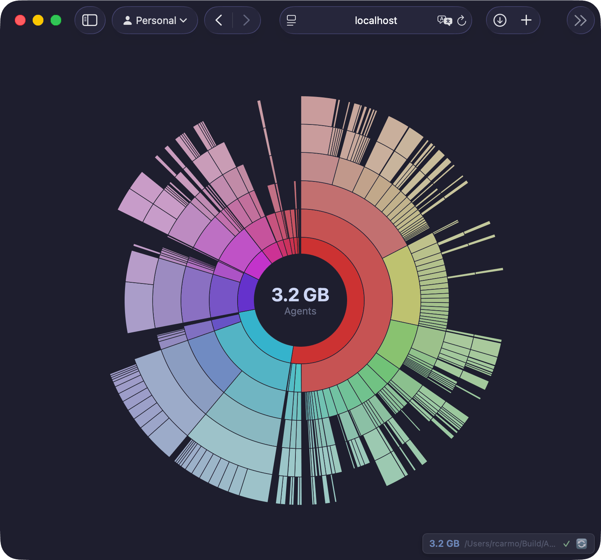

# Daisy 🌼

A live disk usage sunburst visualizer built with Bun. Watch your filesystem in real-time with an interactive radial treemap.

> **Note**: This project was created as a demonstration of AI-assisted, SPEC driven development speed to annoy a couple of curmudgeons. The Bun application went from [SPEC.md](SPEC.md) to working MVP in approximately **10 minutes** using GitHub Copilot. That includes asking it to copy the `skel` prompts from [`agentbox`](https://github.com/rcarmo/agentbox), and it took me more effort to take the screenshots and tweak this README than to build the actual app... Then it took it **3 minutes** to add the native SwiftUI version (see [swift/README.md](swift/README.md), which took me a while to add the new screenshot to). Human pedantic fixes took... twice as long as the AI-assisted coding. 🤖🚀



## Features

- 📊 **Sunburst Diagram** - Interactive radial treemap visualization
- 🔄 **Live Updates** - Real-time filesystem monitoring via SSE
- 🚀 **Zero Dependencies** - Built entirely with Bun built-ins
- 🎨 **Rainbow Colors** - Beautiful HSL-based color scheme
- 🖱️ **Interactive** - Click to zoom, hover for details
- ⚡ **Fast** - Efficient scanning with size caching

## Installation

```bash
# Clone the repository
git clone https://github.com/rcarmo/daisy.git
cd daisy

# Install dependencies
bun install

# Run
bun run src/cli.ts /path/to/watch
```

## Usage

```bash
daisy [options] <path>

Options:
  -p, --port <number>     Server port (default: 3210)
  -d, --depth <number>    Max directory depth to scan (default: 10)
  -i, --ignore <pattern>  Ignore patterns (can be repeated)
  --no-ignore             Disable default ignore patterns (see [docs/IGNORE.md](docs/IGNORE.md))
  -o, --open              Open browser automatically
  -w, --watch             Enable file watching (default: true)
  --no-watch              Disable file watching
  -h, --help              Show help
  -v, --version           Show version

Examples:
  daisy .
  daisy ~/Documents --port 8080 --depth 5
  daisy /var/log -i "*.tmp" -i "node_modules"
  daisy ~/Downloads --no-ignore
```

## Development

```bash
# Install dependencies
make install

# Run in development mode
make dev

# Run linter
make lint

# Run tests
make test

# Run all checks
make check
```

## How It Works

1. **Scanner** - Recursively traverses the directory tree, calculating sizes
2. **Watcher** - Monitors filesystem changes using Bun's native `fs.watch`
3. **Server** - Serves the web UI and streams updates via SSE
4. **Renderer** - Client-side SVG sunburst chart with smooth animations

## API

| Endpoint     | Method | Description                      |
| ------------ | ------ | -------------------------------- |
| `/`          | GET    | Web viewer                       |
| `/api/tree`  | GET    | Current directory tree as JSON   |
| `/api/events`| GET    | SSE stream for real-time updates |
| `/api/info`  | GET    | Server info and settings         |

## License

MIT
