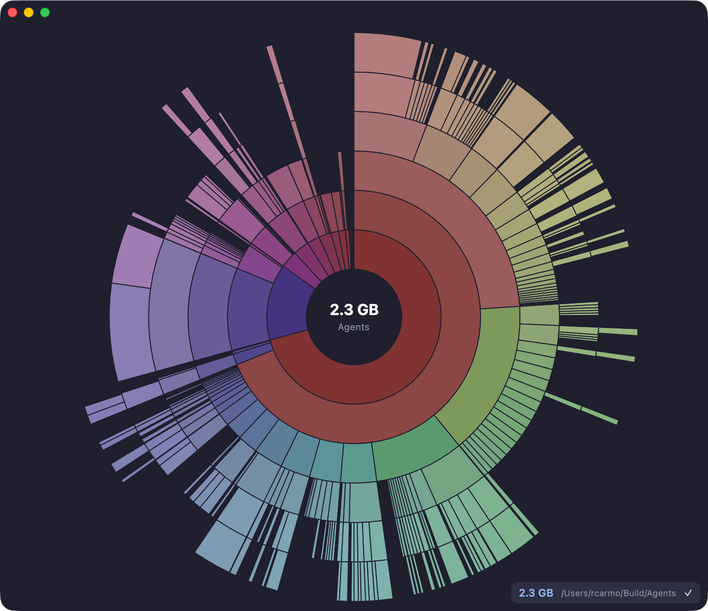

# Daisy Swift 🌼

Native macOS disk usage sunburst visualizer, built with Swift and SwiftUI.



## Features

- 📊 **Native Sunburst** - SwiftUI Canvas-based rendering
- 🪟 **Floating Window** - Always-on-top utility panel
- 👀 **Live Updates** - FSEvents-based file watching
- 🎨 **Change Highlighting** - Bright colors for changed segments
- ⚡ **Fast** - Native performance, no runtime dependencies

## Building

```bash
# Build debug version
swift build

# Build release version
swift build -c release

# Or use the Makefile from parent directory
make swift-build
```

## Usage

```bash
# Run directly
.build/debug/daisy <path>

# With options
.build/release/daisy ~/Documents --depth 5

# Or via Makefile
make swift-run ARGS="~/Documents"
make swift-dev  # watches parent directory
```

## Options

| Option            | Description                              |
| ----------------- | ---------------------------------------- |
| `-d, --depth <n>` | Maximum directory depth (default: 10)    |
| `--no-ignore`     | Disable default ignore patterns          |
| `-h, --help`      | Show help                                |
| `-v, --version`   | Show version                             |

## Architecture

- `main.swift` - CLI entry point, argument parsing
- `FileNode.swift` - Data model for directory tree
- `DirectoryScanner.swift` - Recursive directory traversal
- `DirectoryWatcher.swift` - FSEvents-based file watching
- `SunburstView.swift` - SwiftUI sunburst chart
- `FloatingPanel.swift` - NSPanel-based floating window

## Requirements

- macOS 13.0+
- Swift 5.9+
